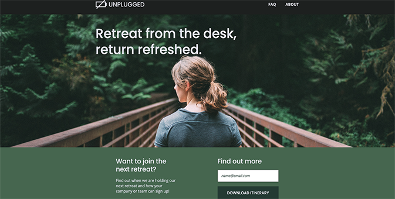

# Unplugged Retreat
Unplugged Retreat is a responsive, multi-page website that dynamically adjusts to different screen sizes. Built with HTML5, CSS3, and Flexbox.

## About
A multi-page website for a fictional client, the Unplugged Retreat website is coded from a Photoshop design comp. The website is responsive, using Flexbox to automatically adjust the layout across mobile, tablet, and desktop.

## Project Background
I built the Unplugged Retreat website as part of Skillcrush’s “Coding Responsive Websites” course. 

The website is coded from a Photoshop design comp for three different screen sizes. It applies Flexbox to position elements and dynamically fit page layout to mobile, tablet, and desktop screens.

Media queries target the browser and allows for CSS styling based on screen sizes. The use of responsive typography scales the site’s text content to different devices.     

During this project, I practiced:

- Coding a multipage website from a Photoshop design comp with separate layouts for mobile, tablet, and desktop screens. 

- Using Flexbox to build grid-based and responsive layouts to dynamically adjust the positioning and alignment of web page content across mobile, tablet, and desktop screens. 

- Working from a mobile-first approach and using media queries to determine standard breakpoints for tablet and desktop screen sizes, telling the browser how to style content accordingly.

- Applying responsive typography, using scalable measurement units to scale text to different screen sizes. 

- Using an iframe to embed a Google map within a web page and applying CSS to make the map layout responsive.  

## Built With 
- HTML5 
- CSS3 
- Flexbox

## Launch
[See the live version of the Unplugged Retreat website here.](https://lonemortensen.github.io/206-unplugged-retreat/)

## Acknowledgements
**Skillcrush** - I coded the Unplugged Retreat website with support and guidance from Skillcrush. 